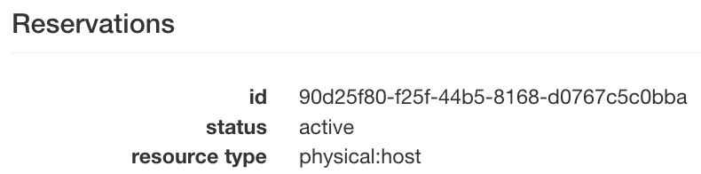

# Using Terraform with Chameleon


[Terraform](https://developer.hashicorp.com/terraform) is both a command line tool, and a configuration language to build, change, and version resources from various Infrastructure as a Service (IaaS) providers. There are pre-existing `providers` to integrate with major cloud platforms, both private and open-source.

In particular, since Terraform natively supports Openstack, it will also work with Chameleon :)

The examples from this post show how to provision instances, networks, and floating IPs across multiple Chameleon Sites, and update them as your needs change.

## Getting started

### Installation and Setup

To follow the examples, you'll need to install the Terraform CLI tool. Instructions for many platforms (Mac, Windows, Linux, etc.) are available from Hashicorp, here: https://developer.hashicorp.com/terraform/downloads

We also need a directory for our terraform files to live in. With some care, this directory can also be versioned in a git repository.

Here, I've made a directory named `tf`. Since we'll be using the [Openstack Terraform Provider](https://registry.terraform.io/providers/terraform-provider-openstack/openstack/latest/docs), we'll define it in `versions.tf` following their documentation.

```
terraform {
required_version = ">= 0.14.0"
  required_providers {
    openstack = {
      source  = "terraform-provider-openstack/openstack"
      version = "~> 1.51.1"
    }
  }
}
```

Finally, we install the dependency by running `terraform init`.

```
> terraform init

Initializing the backend...

Initializing provider plugins...
- Finding terraform-provider-openstack/openstack versions matching "~> 1.51.1"...
- Installing terraform-provider-openstack/openstack v1.51.1...
- Installed terraform-provider-openstack/openstack v1.51.1 (self-signed, key ID 4F80527A391BEFD2)

Partner and community providers are signed by their developers.
If you'd like to know more about provider signing, you can read about it here:
https://www.terraform.io/docs/cli/plugins/signing.html

Terraform has created a lock file .terraform.lock.hcl to record the provider
selections it made above. Include this file in your version control repository
so that Terraform can guarantee to make the same selections by default when
you run "terraform init" in the future.

Terraform has been successfully initialized!

You may now begin working with Terraform. Try running "terraform plan" to see
any changes that are required for your infrastructure. All Terraform commands
should now work.

If you ever set or change modules or backend configuration for Terraform,
rerun this command to reinitialize your working directory. If you forget, other
commands will detect it and remind you to do so if necessary.
```

## Authenticating with the Openstack Provider
Although Chameleon supports single-sign-on using Openstack's `v3oidcpassword` method, Terraform's Openstack Provider does not. Therefore, you'll need to [get an application credential](https://chameleoncloud.readthedocs.io/en/latest/technical/cli.html#creating-an-application-credential) for each Chamelon site that you want to use with Terraform.

We recommend storing them as a `clouds.yaml` file, to decouple them from the terraform code, and avoid checking secrets into a git repo. Openstack clients will look for this file either in the current directory, or at `~/.config/openstack/clouds.yaml`

If you want to authenticate to multiple different projects, or especially multiple sites, you can add more credentials to the lists in the file. It will look something like the following:

```
clouds:
  kvm:
    region_name: "KVM@TACC"
    interface: "public"
    identity_api_version: 3
    auth_type: "v3applicationcredential"
    auth:
      auth_url: https://kvm.tacc.chameleoncloud.org:5000
      application_credential_id: "<redacted_kvm_id>"
      application_credential_secret: "<redacted_kvm_secret>"
  uc:
    region_name: "CHI@UC"
    interface: "public"
    identity_api_version: 3
    auth_type: "v3applicationcredential"
    auth:
      auth_url: https://chi.uc.chameleoncloud.org:5000
      application_credential_id: "<redacted_uc_id>"
      application_credential_secret: "<redacted_uc_secret>"
  tacc:
    region_name: "CHI@TACC"
    interface: "public"
    identity_api_version: 3
    auth_type: "v3applicationcredential"
    auth:
      auth_url: https://chi.tacc.chameleoncloud.org:5000
      application_credential_id: "<redacted_tacc_id>"
      application_credential_secret: "<redacted_tacc_secret>"
```
Note that each site has its own application credential ID, secret, and auth_url.

Now that we have our `clouds.yaml`, we can refer to a site by name:

```
# Configure the OpenStack Provider
provider "openstack" {
    cloud = "kvm"
}
```

Now that we have the provider in place, we can start definining resources.

## A simple example

This example uses KVM@TACC, and is the most "generic" way to use terraform, since most public clouds only offer VMs, not baremetal or reservations.

Say you want to launch an instance, and you already have the following information:
- The flavor name you want to use
- The name of a keypair you've uploaded
- the name of a disk image to use
- the name of a network to connect to
- what yo name your instance

Since we know these beforehand, we can just put them in as strings, and terraform will request it for us. We also know that we want a public IP attached to our instance, and to be able to SSH to it.

```
# get a floating IP
resource "openstack_networking_floatingip_v2" "fip_1" {
    pool       = "public"
}

resource "openstack_compute_instance_v2" "test_instance" {
    name = "test_instance"
    image_name = "CC-Ubuntu20.04"
    flavor_name = "m1.small"
    key_pair = "msherman-laptop"
    network {
      name = "sharednet1"
    }
}

# attach the floating IP to the instance
resource "openstack_compute_floatingip_associate_v2" "fip_1" {
    floating_ip = openstack_networking_floatingip_v2.fip_1.address
    instance_id = openstack_compute_instance_v2.test_instance.id
}

```

Then, to apply, we run `terraform apply`, and it will print out the planned changes. If we type `yes` to confirm, it will create them for us.
```
openstack_networking_floatingip_v2.fip_1: Creating...
openstack_compute_instance_v2.test_instance: Creating...
openstack_networking_floatingip_v2.fip_1: Creation complete after 9s [id=af1bd643-2d84-4cb9-9c5f-1a9ccf6dea88]
openstack_compute_instance_v2.test_instance: Still creating... [10s elapsed]
openstack_compute_instance_v2.test_instance: Still creating... [20s elapsed]
openstack_compute_instance_v2.test_instance: Creation complete after 24s [id=7533c4dd-e335-47b8-a4ab-c5931ed4af68]
openstack_compute_floatingip_associate_v2.fip_1: Creating...
openstack_compute_floatingip_associate_v2.fip_1: Creation complete after 5s [id=129.114.26.20/7533c4dd-e335-47b8-a4ab-c5931ed4af68/]

Apply complete! Resources: 3 added, 0 changed, 0 destroyed.

Outputs:

instance_public_ip = "129.114.26.20"
```

But, we notice that `ssh cc@129.114.26.20` isn't working! On KVM we need to add a security group to our instance.
So, we'll add the following:
```
# Define a security group for our instance
resource "openstack_networking_secgroup_v2" "secgroup_1" {
  name        = "secgroup_1"
  description = "My neutron security group"
}

# add a rule to allow ssh
resource "openstack_networking_secgroup_rule_v2" "secgroup_rule_1" {
  direction         = "ingress"
  ethertype         = "IPv4"
  protocol          = "tcp"
  port_range_min    = 22
  port_range_max    = 22
  remote_ip_prefix  = "0.0.0.0/0"
  security_group_id = openstack_networking_secgroup_v2.secgroup_1.id
}
```

And update our instance resource with the security group ID:
```
# Create the instance, referencing the security group
resource "openstack_compute_instance_v2" "test_instance" {
    name = "test_instance"
    image_name = "CC-Ubuntu20.04"
    flavor_name = "m1.small"
    key_pair = "msherman-laptop"
    network {
      name = "sharednet1"
    }
    security_groups = [openstack_networking_secgroup_v2.secgroup_1.id]
}
```

Now, when we apply, terraform only modifies the resources in place, because it understands the current state.
```
❯ terraform apply
openstack_networking_floatingip_v2.fip_1: Refreshing state... [id=af1bd643-2d84-4cb9-9c5f-1a9ccf6dea88]
openstack_compute_instance_v2.test_instance: Refreshing state... [id=7533c4dd-e335-47b8-a4ab-c5931ed4af68]
openstack_compute_floatingip_associate_v2.fip_1: Refreshing state... [id=129.114.26.20/7533c4dd-e335-47b8-a4ab-c5931ed4af68/]

Terraform used the selected providers to generate the following execution plan. Resource actions are indicated with the
following symbols:
  + create
  ~ update in-place

Terraform will perform the following actions:

  # openstack_compute_instance_v2.test_instance will be updated in-place
  ~ resource "openstack_compute_instance_v2" "test_instance" {
        id                  = "7533c4dd-e335-47b8-a4ab-c5931ed4af68"
        name                = "test_instance"
      ~ security_groups     = [
          - "default",
        ] -> (known after apply)
        tags                = []
        # (15 unchanged attributes hidden)

        # (1 unchanged block hidden)
    }

  # openstack_networking_secgroup_rule_v2.secgroup_rule_1 will be created
  + resource "openstack_networking_secgroup_rule_v2" "secgroup_rule_1" {
      + direction         = "ingress"
      + ethertype         = "IPv4"
      + id                = (known after apply)
      + port_range_max    = 22
      + port_range_min    = 22
      + protocol          = "tcp"
      + region            = (known after apply)
      + remote_group_id   = (known after apply)
      + remote_ip_prefix  = "0.0.0.0/0"
      + security_group_id = (known after apply)
      + tenant_id         = (known after apply)
    }

  # openstack_networking_secgroup_v2.secgroup_1 will be created
  + resource "openstack_networking_secgroup_v2" "secgroup_1" {
      + all_tags    = (known after apply)
      + description = "My neutron security group"
      + id          = (known after apply)
      + name        = "secgroup_1"
      + region      = (known after apply)
      + tenant_id   = (known after apply)
    }

Plan: 2 to add, 1 to change, 0 to destroy.
```

And now SSH works!


To tear down what your provisioned, carefully run `terraform destroy`.

## Using this with Baremetal
We can do the same with a baremetal site, but need to change a few things.

We'll need an application credential and auth_url for a baremetal site, like CHI@TACC.
In addition, we'll need to make the blazar reservation ourselves, since Terraform doesn't (yet) know about blazar.

Our `providers.tf` now looks like this, since we added a credential for `tacc` to our `clouds.yaml`.
```
provider "openstack" {
    cloud = "tacc"
}
```

You'll also need to make a [reservation](https://chameleoncloud.readthedocs.io/en/latest/technical/reservations.html#reservations) for a node to use here, since all of the Chameleon bare-metal sites are reservation based.

Once you've made the reservation, look at the `lease details` page, and get the `reservation_id` corresponding to the type `physical:host`



Now, we can define our instance again. The only changes from KVM are as follows:

* we use the flavor `baremetal`
* We add the `reservation` property to `scheduler_hints`
* We remove security groups, because baremetal doesn't support them

```
# Create the instance, referencing the baremetal flavor, and scheduler hint
resource "openstack_compute_instance_v2" "test_instance" {
    name = "test_instance"
    image_name = "CC-Ubuntu20.04"
    flavor_name = "baremetal"
    key_pair = "msherman-laptop"
    network {
      name = "sharednet1"
    }
    scheduler_hints {
      additional_properties = {
      "reservation" = "90d25f80-f25f-44b5-8168-d0767c5c0bba"
    }
  }
}
```

Now, we again run `terraform apply`. Since it can take a while to launch a baremetal node, we can run this in the background.

```
openstack_compute_instance_v2.test_instance: Creating...
openstack_compute_instance_v2.test_instance: Still creating... [10s elapsed]
openstack_compute_instance_v2.test_instance: Still creating... [20s elapsed]
openstack_compute_instance_v2.test_instance: Still creating... [30s elapsed]
openstack_compute_instance_v2.test_instance: Still creating... [40s elapsed]
openstack_compute_instance_v2.test_instance: Still creating... [50s elapsed]
...
openstack_compute_instance_v2.test_instance: Still creating... [7m10s elapsed]
openstack_compute_instance_v2.test_instance: Creation complete after 7m20s [id=5ab422c4-25ec-4379-99fb-08cfaaa7286f]
openstack_compute_floatingip_associate_v2.fip_1: Creating...
openstack_compute_floatingip_associate_v2.fip_1: Creation complete after 1s [id=129.114.109.142/5ab422c4-25ec-4379-99fb-08cfaaa7286f/]

Apply complete! Resources: 2 added, 0 changed, 0 destroyed.

Outputs:

instance_public_ip = "129.114.109.142"
```


## Across two sites!

We can extend our TACC example to also launch a node at UC.

However, we'll need to modify our syntax a little bit, as we have two copies of the `openstack` provider.

```
provider "openstack" {
    cloud = "tacc"
}
provider "openstack" {
    alias = "uc"
    cloud = "uc"
}
```

The `alias` tells terraform how to refer to each provider, while as before, `cloud` tells it which entry in `clouds.yaml` to use for authentication. If a provider has no alias, it will be used as the default.

Each terraform object also needs a unique identifier, hense the `_uc` suffix on some entries.

```
### UC #################
# Get a Floating IP to use
resource "openstack_networking_floatingip_v2" "fip_1_uc" {
  provider = openstack.uc
  pool       = "public"
}

# Create the instance, referencing the baremetal flavor, and scheduler hint
resource "openstack_compute_instance_v2" "test_instance_uc" {
    provider = openstack.uc
    name = "test_instance"
    image_name = "CC-Ubuntu20.04"
    flavor_name = "baremetal"
    key_pair = "msherman-laptop"
    network {
      name = "sharednet1"
  }
  scheduler_hints {
    additional_properties = {
    "reservation" = "4b4d2a2f-4fbb-4c81-b3e2-c8091e50d3fe"
    }
  }
}

# attach the floating IP to our instance
resource "openstack_compute_floatingip_associate_v2" "fip_1_uc" {
  provider = openstack.uc
  floating_ip = openstack_networking_floatingip_v2.fip_1_uc.address
  instance_id = openstack_compute_instance_v2.test_instance_uc.id
}

# print out what IP to SSH to
output "instance_public_ip_tacc" {
  value = openstack_networking_floatingip_v2.fip_1.address
}
output "instance_public_ip_uc" {
  value = openstack_networking_floatingip_v2.fip_1_uc.address
}

```


```
openstack_compute_instance_v2.test_instance_uc: Creating...
openstack_compute_instance_v2.test_instance_uc: Still creating... [10s elapsed]
openstack_compute_instance_v2.test_instance_uc: Still creating... [20s elapsed]
openstack_compute_instance_v2.test_instance_uc: Still creating... [30s elapsed]
openstack_compute_instance_v2.test_instance_uc: Still creating... [40s elapsed]
openstack_compute_instance_v2.test_instance_uc: Still creating... [50s elapsed]
...
openstack_compute_instance_v2.test_instance_uc: Still creating... [8m30s elapsed]
openstack_compute_instance_v2.test_instance_uc: Creation complete after 8m37s [id=c3d11e40-93ea-41a8-9450-eb34a8fd0436]
openstack_compute_floatingip_associate_v2.fip_1_uc: Creating...
openstack_compute_floatingip_associate_v2.fip_1_uc: Creation complete after 1s [id=192.5.87.99/c3d11e40-93ea-41a8-9450-eb34a8fd0436/]

Apply complete! Resources: 2 added, 0 changed, 0 destroyed.

Outputs:

instance_public_ip_tacc = "129.114.109.142"
instance_public_ip_uc = "192.5.87.99"
```

## Other tips and thoughts

We don't have to hardcode everything. For example, say you wanted to specify the reservation each time you ran terraform, to use it with different leases?

You can define terraform variables, such as
```
variable uc_reservation_id = {}
```

Then refer to it as `"reservation" = var.uc_reservation_id`


We can also make smarter queries with `data` resources.

Say instead of image names, we want to look up images by tag?
This snippet will get the latest chameleon supported image for Ubuntu 20.04, regardless of name.

```
data "openstack_images_image_v2" "ubuntu-20-latest" {
  most_recent = true

  visibility = "public"
  properties = {
    build-distro  = "ubuntu"
    build-release = "focal"
    build-variant = "base"
  }
}
```
You can refer to it in your instance resource by `openstack_images_image_v2.ubuntu-20-latest.id`


## Wrapping Up

These are all just examples, but we'd love to hear your use-cases and ideas. Many complicated configurations can be concisely expressed in terraform, and as you saw with providers, are relatively portable between sites, and even to different cloud platforms.

A common pattern to extend this is using cloud-init to run scripts after node boots, or using something like Ansible to configure servers once they're online, but that's a future topic.
